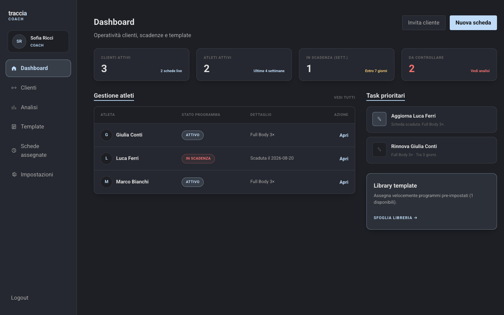
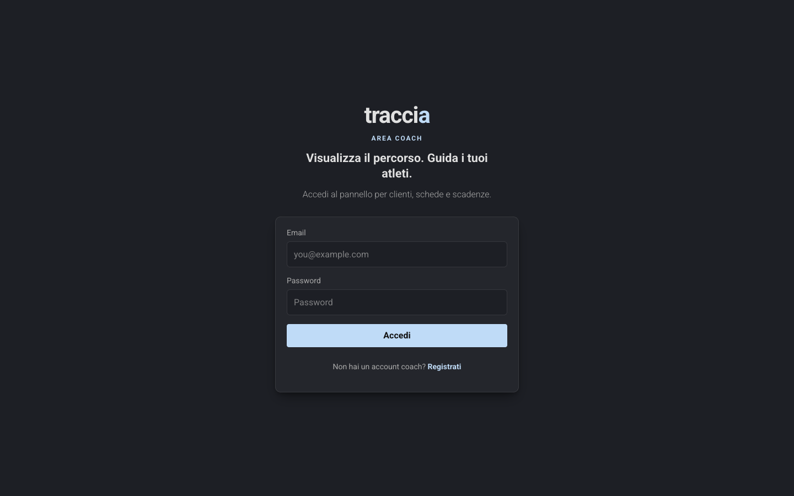
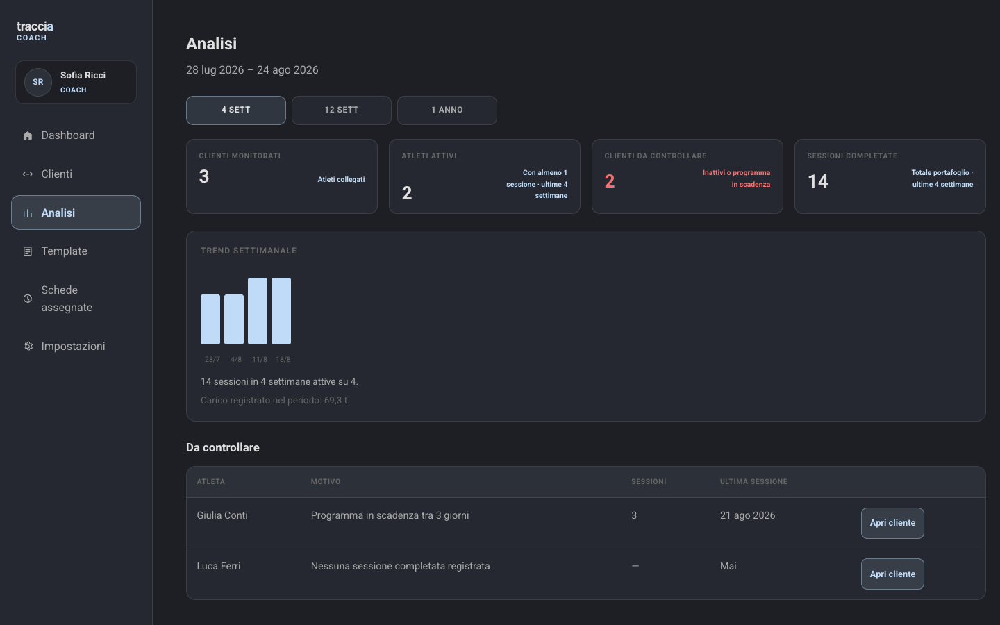
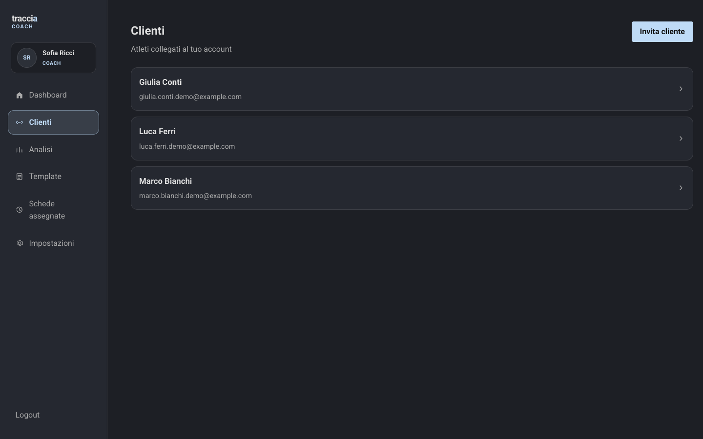
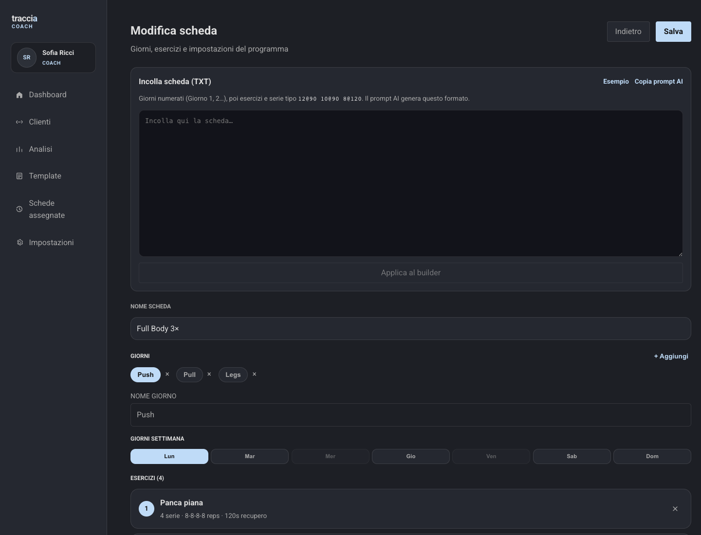
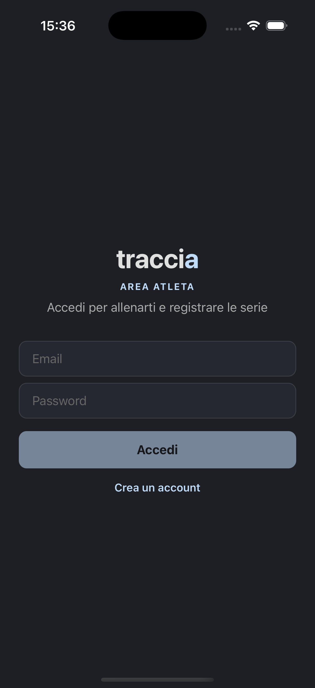
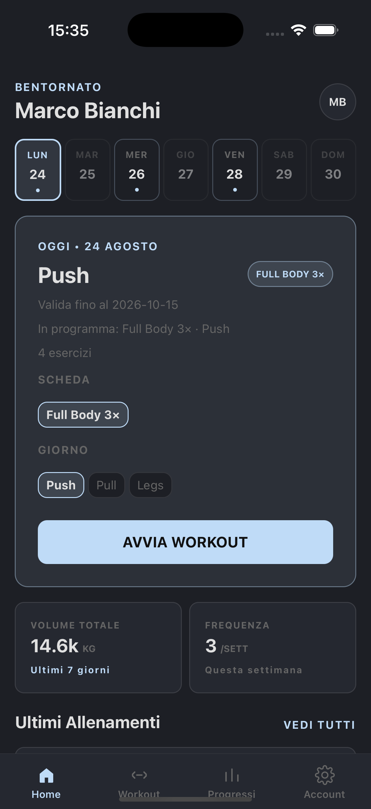
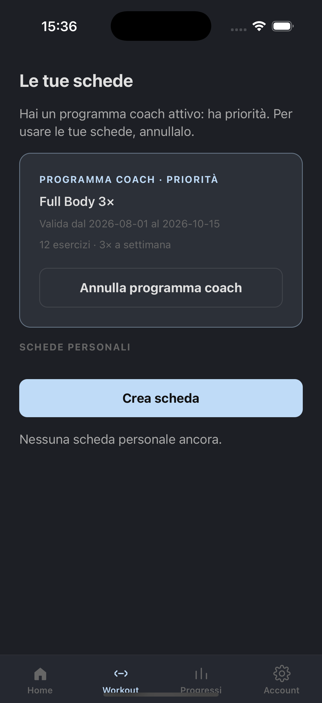
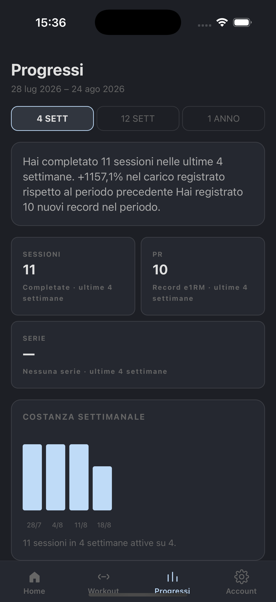

# traccia

Coach panel on the web + athlete app on iOS/Android. Programs, sessions, and analytics.

<p align="center">
  
</p>

## Coach (web)

Assign programs, build workouts, follow clients, and check analytics.

<p align="center">
  
  
</p>

<p align="center">
  
  
</p>

## Athlete (mobile)

Open today’s program, start the workout, log sets, track progress.

<p align="center">
  
  
  
  
</p>

## Stack

| | |
| --- | --- |
| Web | React + Vite + TypeScript |
| Mobile | Expo + React Native + TypeScript |
| API | Express + Drizzle + Postgres |

## Dev

```bash
npm run db:up          # Postgres
cd be && npm run dev   # API :3005
cd fe && npm run dev   # Web :5173
cd mobile && npm start # Expo (i for iOS)
```

See [`AGENTS.md`](AGENTS.md) for details.
